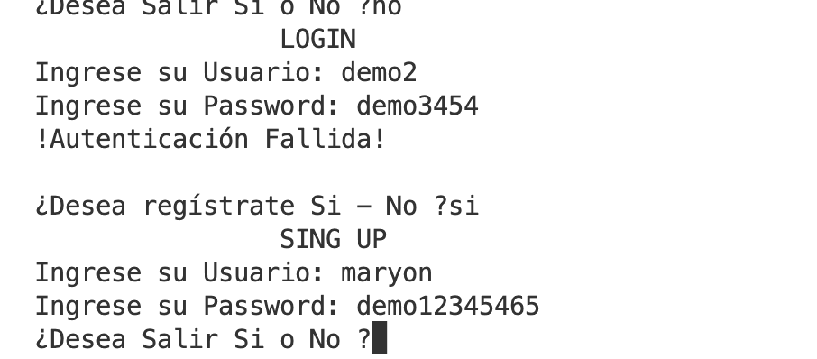

# Curso de programación #1 2023 Q3

## Contenido

- Estructura
  - Secuenciales
  - Condiciónales
  - Repetitivas
- Lista
- CRUD
- Funciones
- Archivos

## Captura del sistema por CLI 

- Login y menu principal

- Verificación

- Registro al sistema
